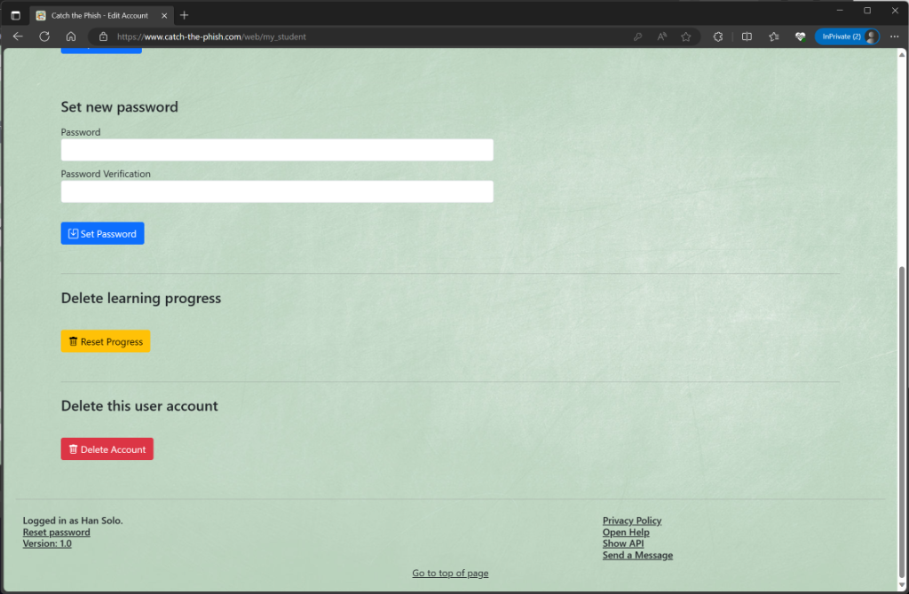

# Account

## New Account

You can create a new account by clicking on _New Account_. This is only possible if you are not already registered.

The following data is required:

| Field           | Description                                                                                                 |
|-----------------|-------------------------------------------------------------------------------------------------------------|
| Name            | Your username (only visible in the Students overview for registered users)                                  |
| E-Mail          | Your e-mail (not visible anywhere, only used to log in and to send system messages)                         |
| Password        | Your password (should be as secure as you want it to be)                                                    |
| Invitation code | If you have an invitation code, you can enter it here to skip the approval by an admin during registration. |

_Note_: The invitation code also defines your role (admin, student).

## Login

You can log in to the application by clicking on _Login_. To do this, you must enter your e-mail and password that you have previously chosen. If you select _Remember me_, you will remain logged in even if you close your browser.
To log out again, simply click on _Logout_.

## Edit Account

If you are already registered, you can edit your account details by clicking on _My Account_.

### Enter data

In the first section you can enter or change the following information:

| Field              | Description                                                                                                                                                       |
|--------------------|-------------------------------------------------------------------------------------------------------------------------------------------------------------------|
| E-Mail             | Your e-mail address (not visible anywhere, only used to log in and to send system messages)                                                                       |
| Description        | Something you want others to know about you                                                                                                                       |
| Image              | Your profile picture (This will be displayed in the _Students_ overview, upload a picture in the _Storage Area_ beforehand in order to be able to select it here) |
| Send notifications | Receive e-mail messages with important system messages, such as a password change                                                                                 |

### Set new password

In the second section you can change your password.

### Delete learning progress

In the third section you can delete all the progress you have achieved. This includes quiz scores and the scores you have achieved playing scenarios.

### Delete account

In the fourth section you can delete your account. Please note that campaigns and scenarios you have created will remain and must be deleted separately.

## Reset Password

If you have forgotten your password, you can reset it by clicking on _Reset password_ in the footer and then entering your e-mail address.
You will then receive an email with a link that you can use to set a new password.

