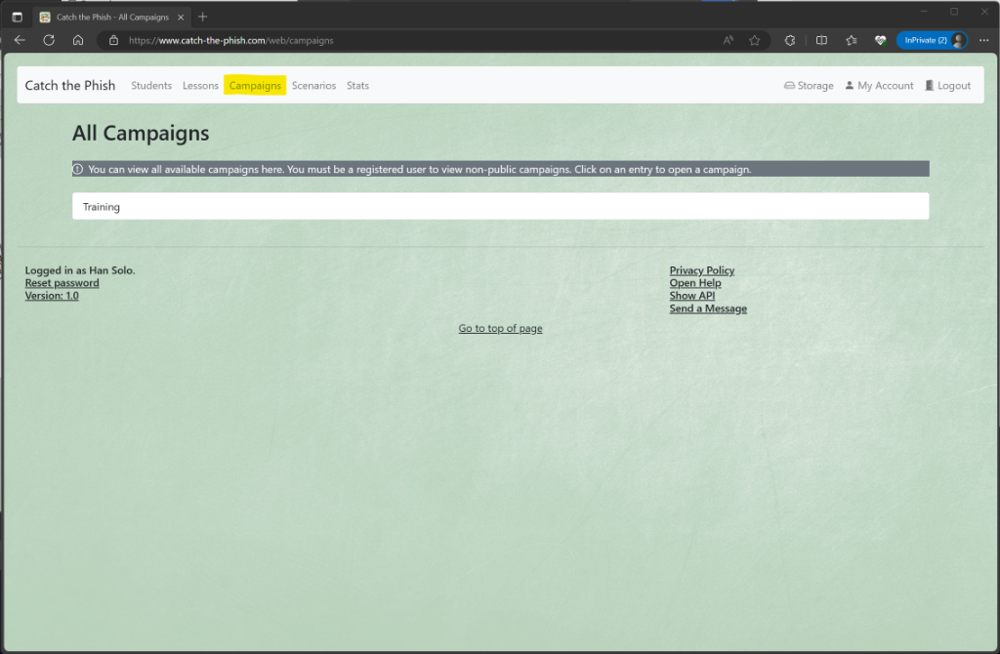
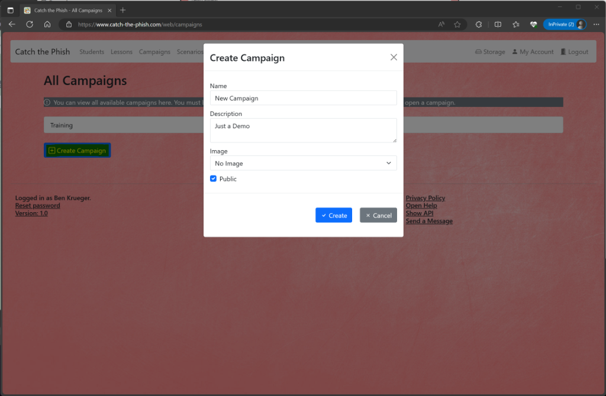
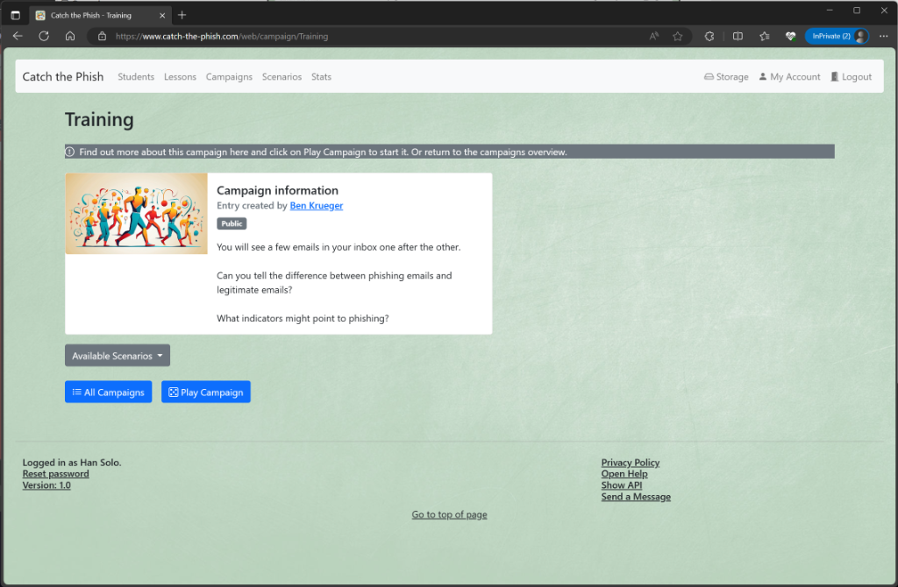
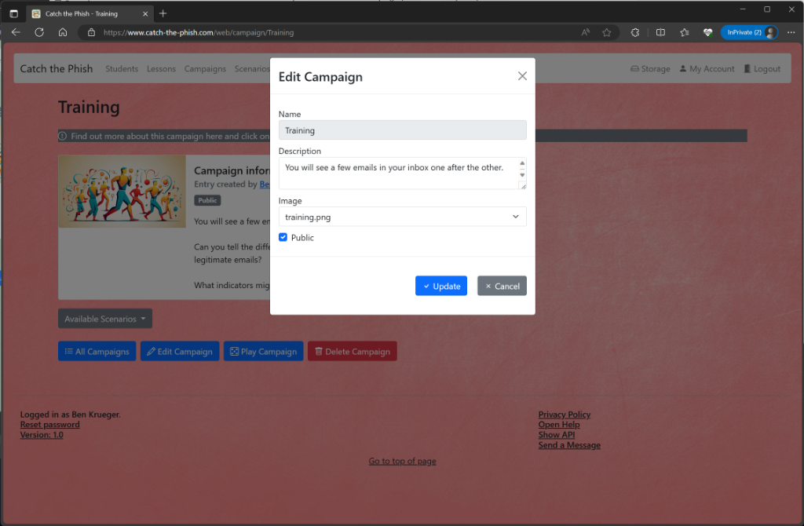

# Campaigns

## All Campaigns

You can see what campaigns are available by clicking on _Campaigns_. 
Campaigns can be either public or closed.  Anonymous users can only view public campaigns. Registered users (with the role `Student` or `Admin`) can also see closed campaigns in the overview.

If you click on an entry, you will get to the detailed view. 

In the section below you can select the following actions:

- The _Create Campaign_ button lets you create a new campaign. (`Admin` role required)

## Detailed View

You can find out more about the campaign in the detailed view. Here you can also see whether the campaign is public or closed.
If you click on the name of the creator, you will be taken directly to the profile page of this user.
If a picture is linked to the campaign, it is also visible here. 
The description box shows additional information.

You can also see scenarios linked to the campaign. Use the dropdown box _Available Scenarios_ to jump to the respective scenario.

In the section below you can select the following actions:

- The _All Campaigns_ button takes you back to the overview page
- The _Edit Campaign_ button lets you edit the campaign (role `Admin` required)
- The _Play Campaign_ button lets you play through all scenarios attached to this campaign
- The _Delete Campaign_ button deletes that campaign (role `Admin` required)

Note: If you delete a campaign all linked scenarios will be deleted as well!

