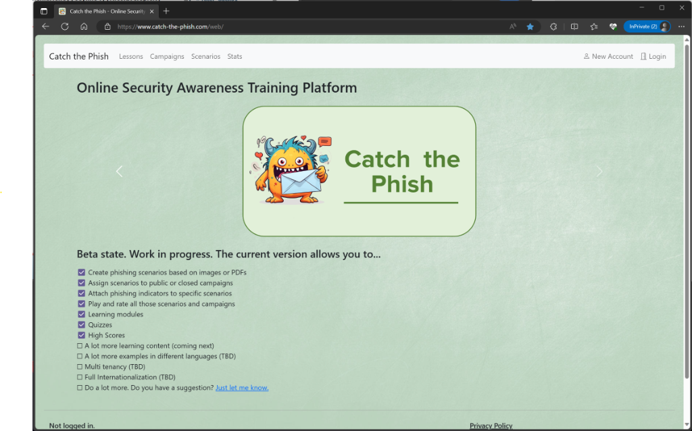

# Home

## About

Catch-the-Phish is an online training platform that allows you to create phishing scenarios based on images or PDF documents. Multiple scenarios can be grouped into campaigns that are public or only available to a closed user group. The platform offers a final rating for each scenario, depending on whether the user has correctly classified it as legitimate or phishing. In addition, indicators can be set that make a message recognisable as phishing.
The platform also offers the option of using and creating learning material in the form of videos and quizzes.

## Features

What does the platform currently offer?

- The platform allows the creation of different campaigns, which can be public or closed.
    - Public campaigns can be viewed by anyone.
    - Closed campaigns can only be viewed by registered users.
- The platform enables the creation of different scenarios that can be assigned to a campaign.
    - A scenario can be, for example, an email, an SMS or any other message.
    - An image or a PDF document can serve as the basis.
    - A scenario can be classified as legitimate or as phishing .
    - Indicators can be set for a scenario, which make the classification particularly clear in the case of a phishing message.
    - You can collect points by successfully solving scenarios
- The platform allows to use learning material such as videos or quizzes
    - Videos can be grouped and support different languages
    - Same for quizzes
    - You can collect points by successfully solving quizzes
- The platform supports different roles (admin, student, anonymous user).
    - An admin can create campaigns, scenarios, videos and quizzes.
    - A student can play closed scenarios, view the learning material and save high scores.
    - An anonymous user can only play public scenarios and view the learning material.
- The platform supports the registration of new users.
    - An admin can approve new users.
    - Invitation codes can be created to allow users to register without additional approval.
- The platform supports S3 storage.
    - Images or PDF documents can be uploaded to S3 storage.
    - This storage can also be used for profile pictures.
- The platform supports emailing.
    - You will receive an email about important changes and activities.
