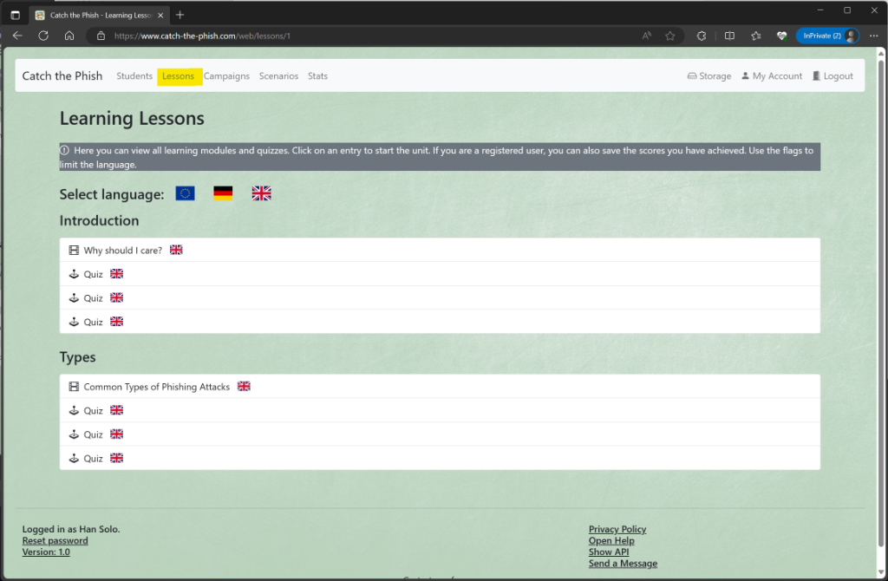
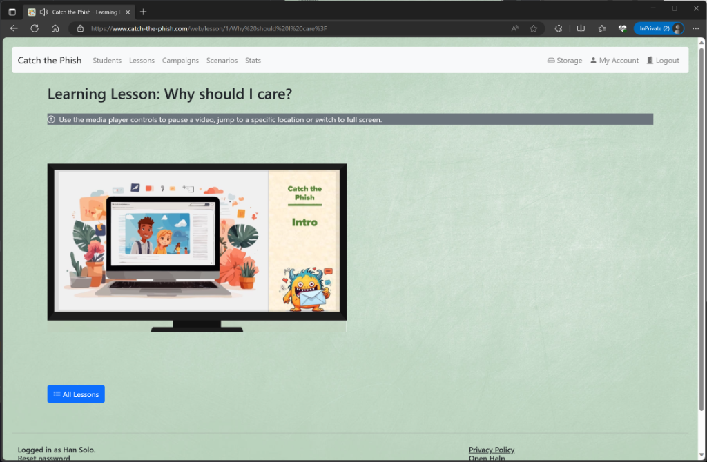
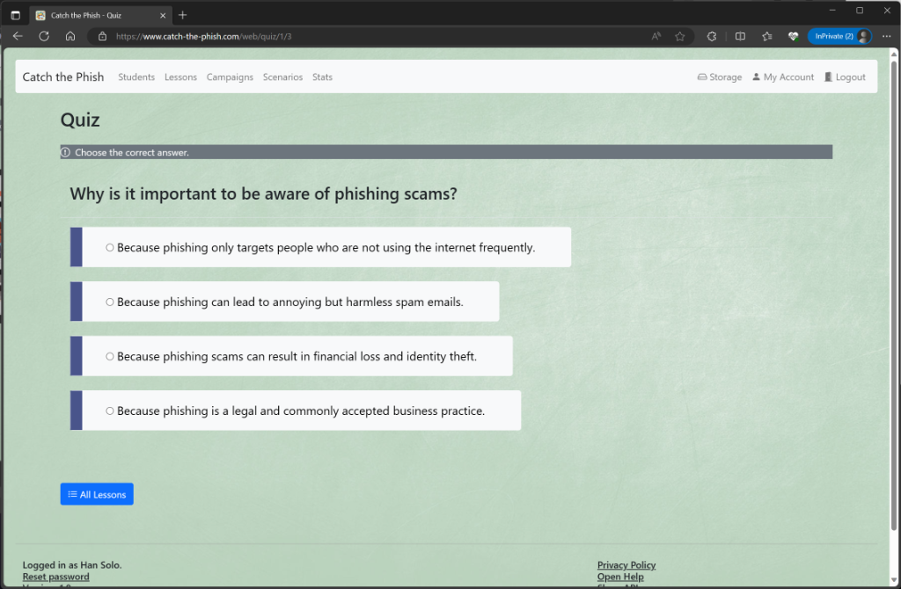

# Campaigns

## All Campaigns

You can see what lessons are available by clicking on _Lessons_. 
A lesson unit can either be a video or a quiz. Use the flag icons to show only units for a given language.

When you click on an entry, you can use it to either watch the video or try a quiz.  
Note: When you have completed a quiz, the score will also be displayed in the overview.

## Video Lesson

When you click on a video, it will play automatically. You can pause it at any time, change its volume or zoom to full screen.

When you click on a quiz, you will be asked one question and four possible answers. Choose the correct one.

