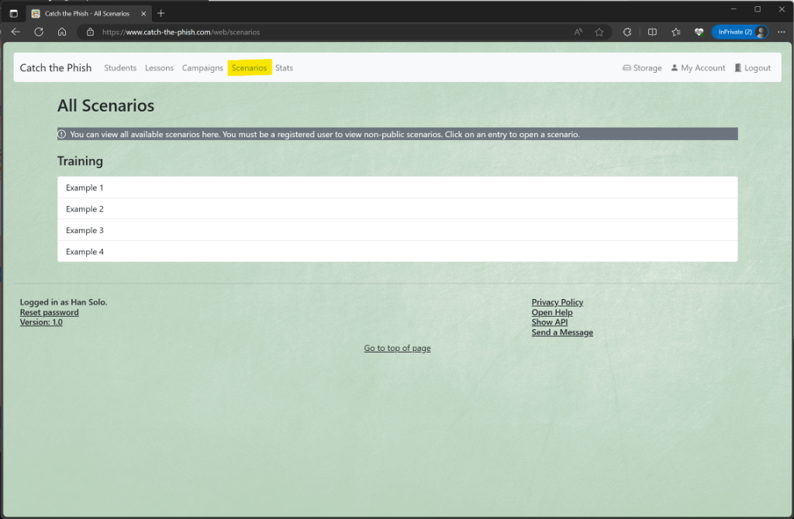
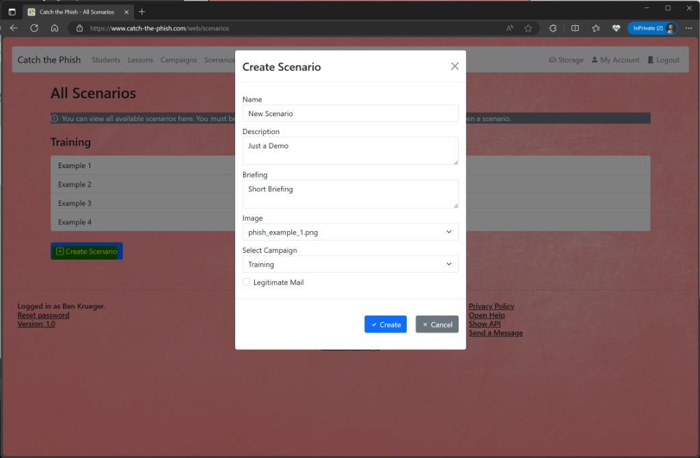
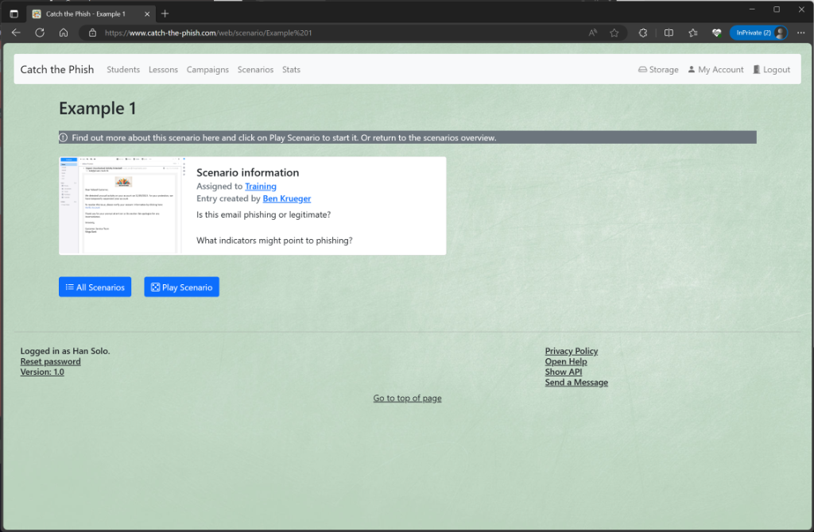
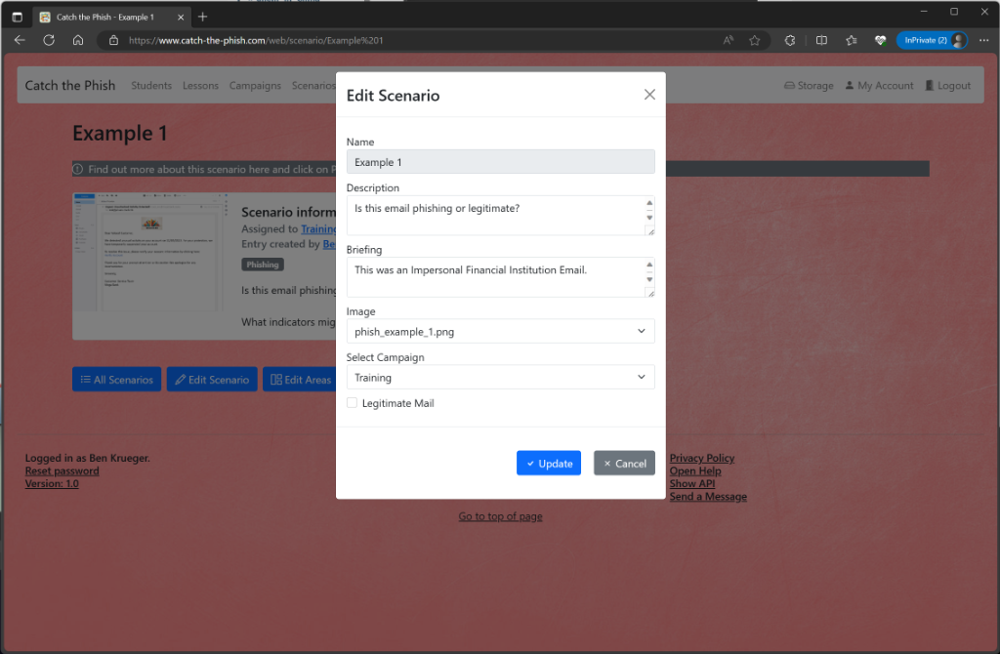
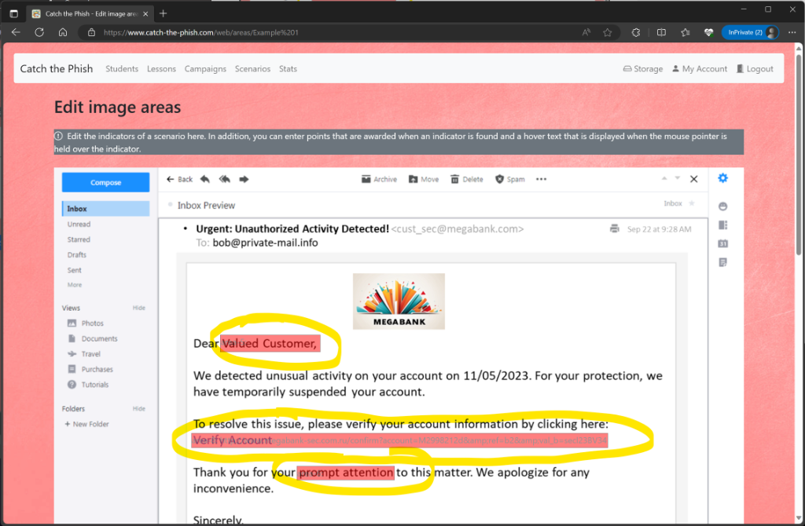
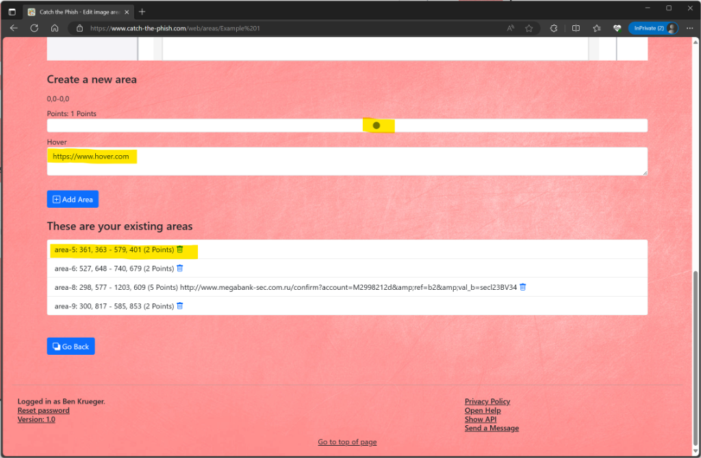
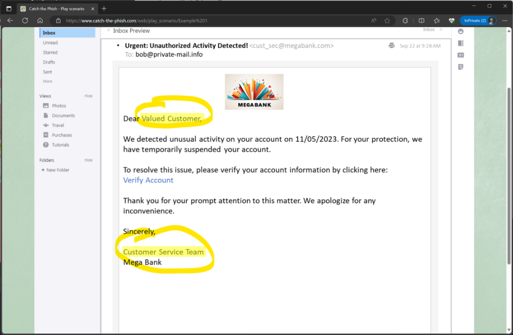
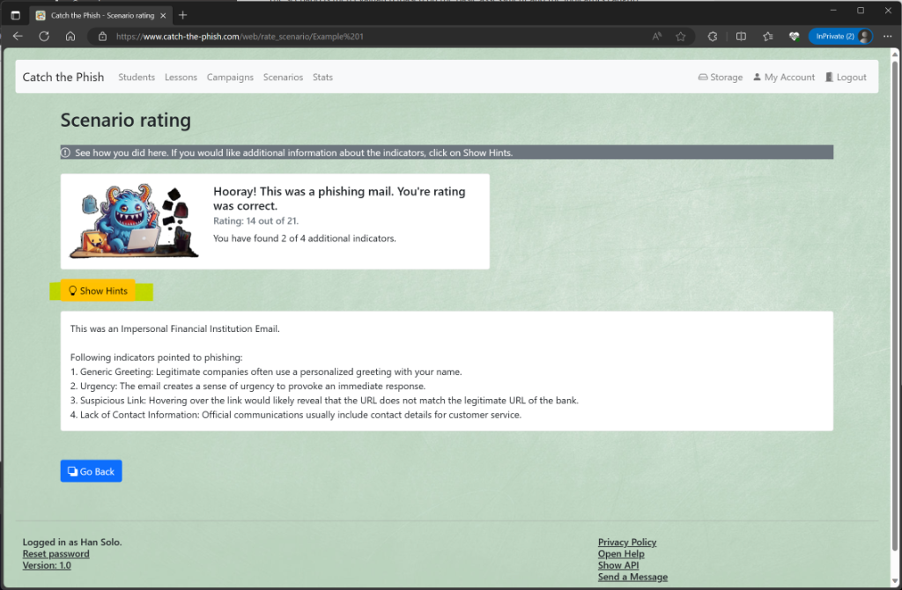

# Scenarios

## All Scenarios

You can see which scenarios are available by clicking on _Scenarios_. Anonymous users can only see scenarios that are assigned to a public campaign. Registered users (with the role `Student` or `Admin`) can see all scenarios in the overview.

If you click on an entry, you will get to the detailed view.  
Note: When you have completed a scenario, the score will also be displayed in the overview.

In the section below you can select the following actions:

- The _Add Scenario_ button lets you create a new scenario (`Admin` role required)

## Detailed View

You can learn more about a scenario in the detailed view. If you click on the creator, you will be taken directly to the profile page of this user. If you click on the name of the campaign, you will be taken directly to the campaign page to which this scenario is assigned. 
You can also see a thumbnail of this scenario.

In the section below you can select the following actions:

- The _Add Scenario_ button takes you back to the overview page
- The _Edit Scenario_ button lets you edit this scenario (`Admin` role required)
- The _Edit Areas_ button lets you create indicators for this scenario (role `Admin` required)
- The _Play Scenario_ button lets you play through this scenario
- The _Delete Scenario_ button deletes this scenario (`Admin` role required)

## Editing indicators

You can create additional indicators for a scenario (mainly phishing) that make the mail or message clear as a phishing message. A user can basically choose whether a scenario is a legitimate or a phishing one. In addition, he can click on the image where he suspects such indicators, which gives additional points.

To create an indicator, drag a box over the area with the mouse. Then select in the area how many points there are when the indicator is clicked. In addition, a text can be entered when the mouse is held over this area. 
Then click on _Add_ to create this indicator.

In the area below you can delete indicators that have already been created.

When an indicator has been created, these areas are highlighted in colour.

## Playing and rating a scenario

The actual function of the platform for users is training by playing scenarios.

Here, the scenario image is displayed and the user can decide whether it is a legitimate or a phishing scenario.

In addition, they can click on places in the image that they consider particularly conspicuous for the respective type (e.g. phishing). 

The scenario is then evaluated (based on the basic assessment and the indicators caught).

