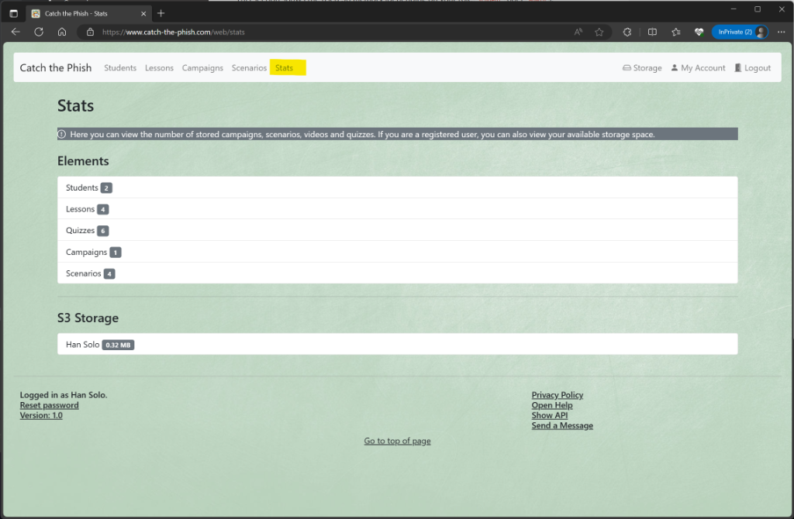

# Stats

The Stats page shows some statistics about the managed items. You can reach it by clicking on _Stats_.
## Elements

This section shows the number of saved campaigns, scenarios, videos and quizzes.

## S3 Storage

This section shows the used S3 memory (depending on your role `Student` oder `Admin`).

