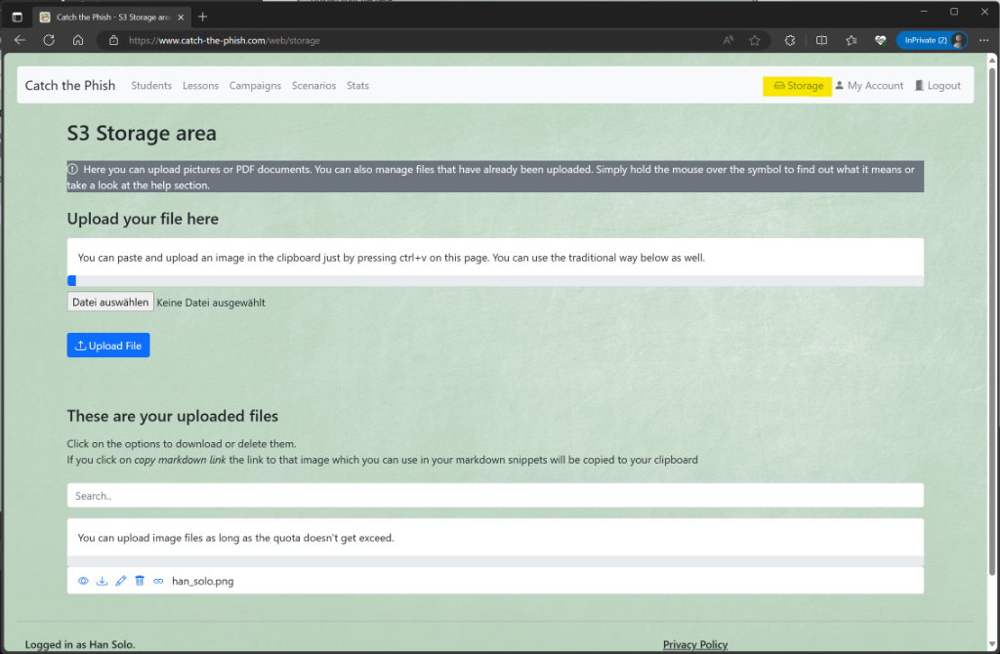
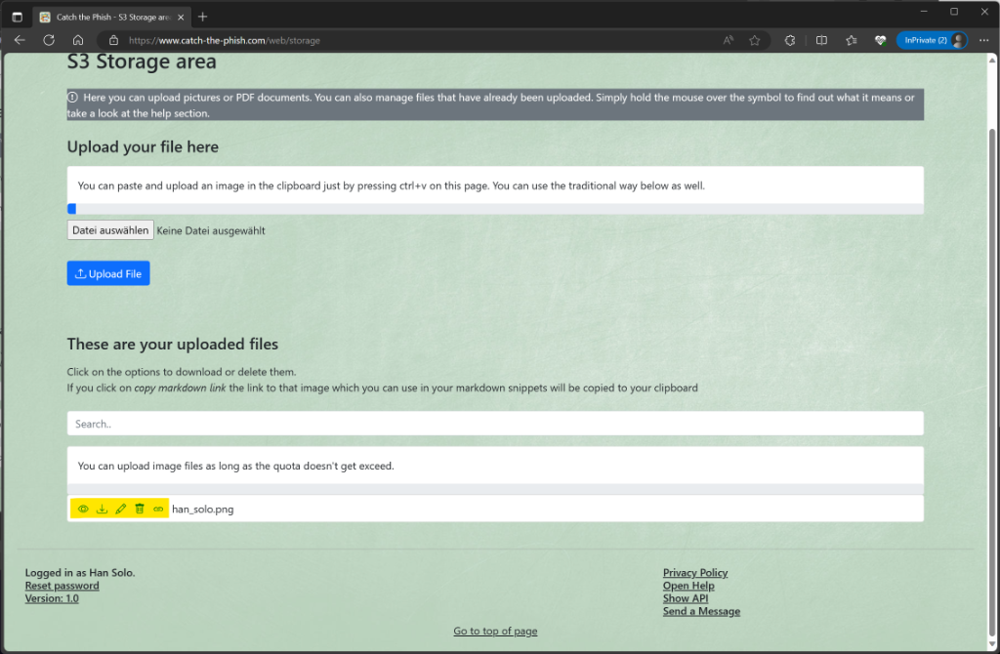

# Storage

## S3 Storage

### Upload images

If you are logged in, you can use the integrated S3 storage to upload pictures and documents. Click on _Storage_ (the user role `Student` or `Admin` is required).

In the first section you can upload pictures. First select a picture and then click on _Upload_.

There is an even easier way to upload pictures. By pressing CTRL-V (or the respective shortcut for paste) on the page, a picture that is in the clipboard will be uploaded automatically.

_Note_: This way, an automatic file name with the current timestamp is assigned. The function is only available if there is a valid image in the clipboard.

### Modify images 

In the second section you can manage your uploaded files.

- The _eye_ symbol displays the image in the browser
- The _download_ symbol lets you download the file again
- The _pencil_ symbol lets you change the file name
- The _trash_ symbol deletes the file again
- The _link_ symbol copies a link to this file to the clipboard

Note: You can use the search field to filter the file names (just enter a part of the name).

