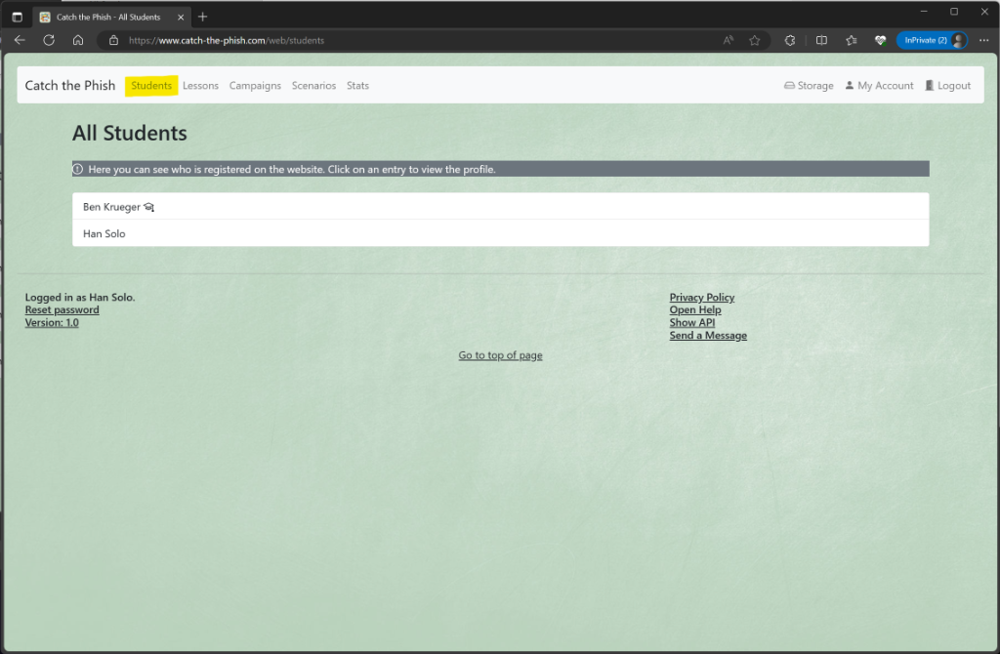
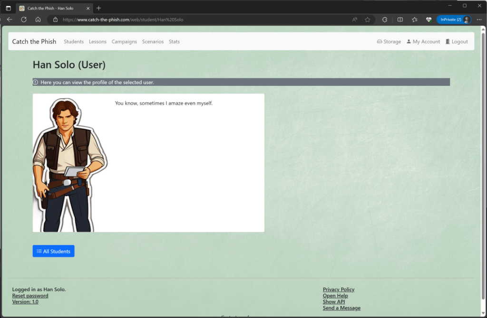

# Students

## All Students

You can see which users are registered on the platform by clicking on _Students_ (`Student` or `Admin` role required).

_Note_: Admins have a special badge.

Clicking on an entry will take you to the details page for the selected user.

## Detailed View

You can find out more about a user in the detailed view. Here you can also see which role (`Student` or `Admin`) the user has.
If the user has uploaded a picture, you can also see it here.
The descriptions box next to it shows you additional information about the user.

In the area below you can select the following actions:

- The _All Students_ button takes you back to the overview page.
